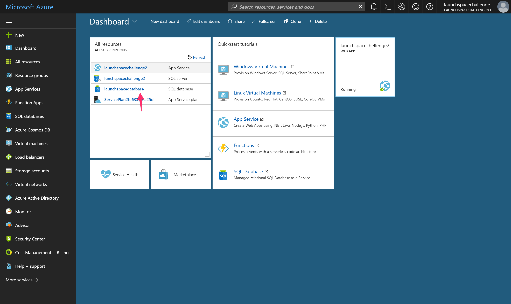

# Activating DreamSpark

https://www.msacademicverify.com/AVE/Verify/NewDefault.aspx?lc=1033&wa=wsignin1.0

# API handler
```
var api = {
     get: function (request, response, next) {
        console.log(request.query);
        var query = {
            sql: "SELECT * FROM Users"
        };
        
        request.azureMobile.data.execute(query)
            .then(function (results) {
                response.json(results);
            })
            .catch(next);
    },
    post: function (request, response, next) {
        console.log(request.query);
        var query = {
            sql: "INSERT INTO Users (name) VALUES ('" + request.query.username + "')"
        };
        
        request.azureMobile.data.execute(query)
            .then(function (results) {
                response.json(results);
            })
            .catch(next);
    }
};

module.exports = api;
```
# Calling API from website

## POST
```
function postRecord() {
    var name = document.getElementById("name").value;
    var xhttp = new XMLHttpRequest();
    xhttp.onreadystatechange = function() {
        if (this.readyState == 4 && this.status == 200) {
            document.getElementById("result").innerHTML = this.responseText;
        }
    };
    xhttp.open("POST", URL + "?username=" + name, true);
    xhttp.send();
}
```

## GET
```
function getRecord() {
    var xhttp = new XMLHttpRequest();
    xhttp.onreadystatechange = function() {
        if (this.readyState == 4 && this.status == 200) {
            var response = JSON.parse(this.responseText);
            for (var i = 0; i < response.length; i++) {
              document.getElementById("result").innerHTML += response[i].name + "<br> ";
            }
        }
    };
    xhttp.open("GET", URL, true);
    xhttp.send();
}
```

# Accessing Query Editor

1. Login to http://portal.azure.com and look for the SQL database your webapp is pointing to


2. Once you've found it, click 'Tools'.


3. Next click 'Query editor (preview)'. If this is your first time, you may be asked to agree to some T&Cs. Click 'OK' when you're done.


4. You should then see a the query editor. From here you can test out your SQL statements and manipulate your data. Before you can run anything, you must login. Click 'Login' at the top.


5. Enter the username and password you set it to when creating the database. Click 'OK' to login.


6. If everything worked as it should, you should see 'Authenticated as...' Now you can go ahead and start running SQL commands.


# Adding Foreign Key

For this section we're going to assume the column you want to add the foreign key to does not exist. If your table already has the column you want to add the foreign key to, you'll need to either delete that column or look up 'how to alter column data type' and change the data type to ```NVARCHAR(255)```.

1. Lets create a new column in our table and set the datatype to ```NVARCHAR(255)```. Remember to replace ```table_name``` to the table you want to add the column to and ```column_name``` to some descriptive name.

```
ALTER TABLE table_name
ADD column_name NVARCHAR(255);
```

2. Now that we've added our new column it's time to add set that column as foreign key. Using the command below, change ```table_name``` to the table we just added the new column to, ```column_name``` to the name of our newly created column, ```table_name_2``` to the table we want to reference that holds the primary key we want to use, and ```column_name_2``` to the column we want to reference.

```
ALTER TABLE table_name
ADD FOREIGN KEY (column_name) REFERENCES table_name_2(column_name_2);
```

3. Now you're done! Try inserting values that don't exist in our table we're referencing and see if it inserts.